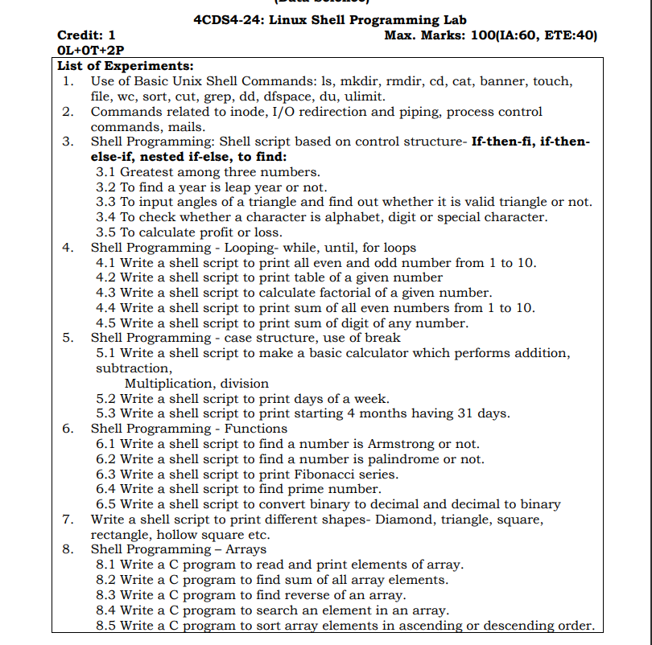

## shell-scripting-programs
In this repository scripting programs asked in LSP lab are discussed 
# Instructions 
1 to run a script create a file name with extension .sh  
2 to execute the script write sh <scripname>  
            eg sh file.sh
                  or 
            bash file.sh
3 to execute c program make files with extension .c  
     to generate compilation file write ~gcc -o file file.c  
     for execution write ./file
     
            
Author: Niraj Ramnani
 
😊 Connect with me on [LinkedIn](https://www.linkedin.com/in/niraj-ramnani)

 

